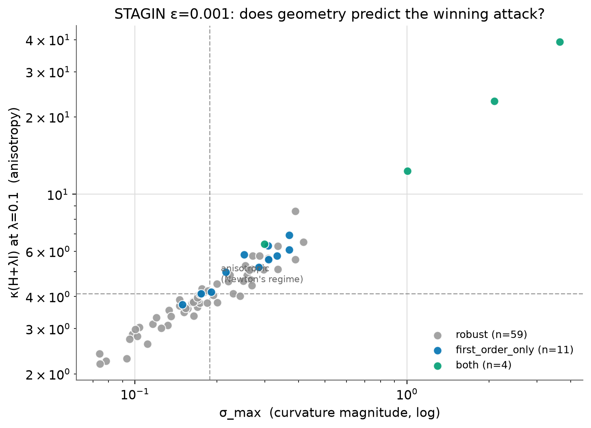
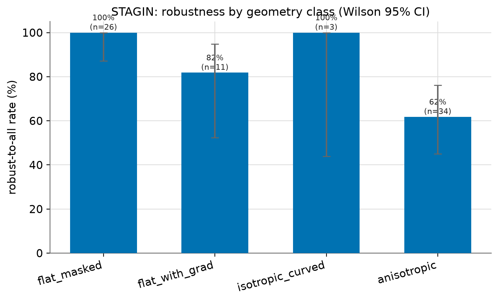
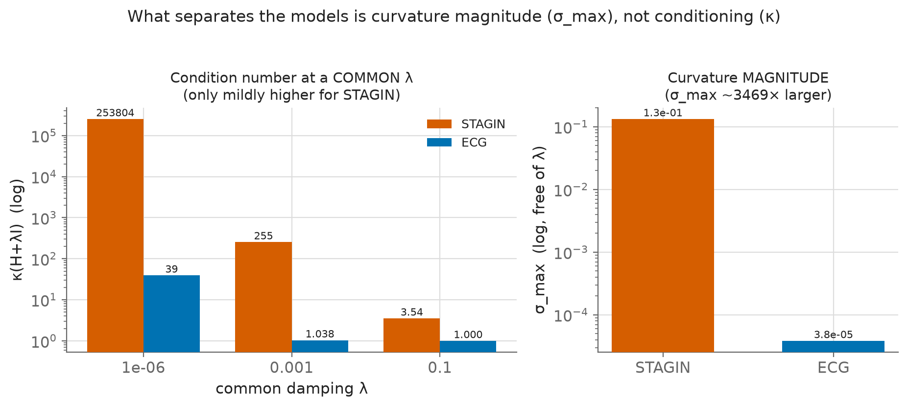
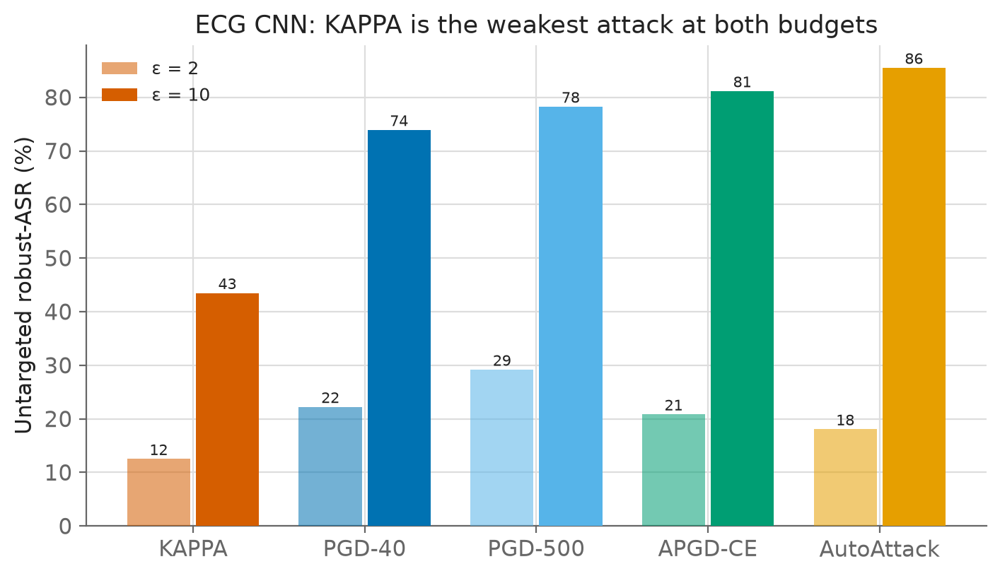

# Can Clinical AI Prove Its Robustness?

> **Nebius Serverless AI Builders Challenge — Healthcare & Life Sciences**

**Blog post:** [Can Clinical AI Prove Its Robustness?](https://medium.com/@diegom4riano/clinical-ai-proves-its-robustness-it-shouldnt-have-e9b9a484561a)

---

A hospital is deciding whether to deploy an AI that reads brain scans. A regulator is deciding whether to authorize a cardiac-rhythm classifier. Both decisions increasingly rely on an **adversarial-robustness certificate** — a report that says the model resists small, malicious input changes. That certificate is only as trustworthy as the tool that produced it.

The standard robustness toolkit was built for image classifiers. Clinical AI uses fundamentally different architectures — graph networks for brain connectivity, recurrent networks for physiological time series — with different input constraints and different failure modes. A test designed for vision can silently mis-measure a clinical model in either direction: **false confidence** (a vulnerable model gets a clean bill of health) or a **false alarm** (a safe model looks catastrophically vulnerable). This project ran into both.

**Three things were built to probe that gap:**

1. **KAPPA** — a curvature-aware second-order attack using Newton-CG steps on Hessian-Vector Products. Model-agnostic; requires only a differentiable PyTorch `forward()`. Implemented in [`hessian.py`](hessian.py).
2. **An evaluation pipeline on Nebius H200s** — KAPPA + five baselines against two clinical models, with paired statistics and a full damping sweep across KAPPA's key hyperparameter, run as parallel serverless jobs.
3. **A geometry profiler** — a cheap pre-attack triage tool (~k HVPs per input, single-pass Lanczos) that classifies each input's loss-surface terrain and predicts attack outcome before any attack runs.

**Hypothesis:** KAPPA would add little on the ECG CNN (BatchNorm smooths the loss surface) but expose hidden vulnerability on STAGIN (graph architecture, rank-deficient fMRI inputs). An initial run seemed to confirm it.

**What that rigor produced** a tool more useful than the attack itself. The geometry profiler may indicates attack outcome before a single attack runs. Every input classified as flat-and-silent was 100% robust to every gradient-based attack, across both models, independently. Not approximately. Not on average. 100%, with tight confidence intervals. This is a cheap, predictive triage tool that tells you — before running anything expensive — which patients need a robustness test and which ones don't.

---

## Key Finding: Geometry Predicts Vulnerability

The profiler classifies each input's loss-surface terrain before any attack runs. Terrain type predicts robustness reliably:

| Class | Signature | Routed attack | STAGIN robust-rate [Wilson 95%] |
|---|---|---|---|
| **flat-masked** | ‖∇‖≈0, σ_max≈0 | skip (or black-box) | **1.00 [0.87, 1.00]** |
| flat-with-gradient | ‖∇‖>0, σ_max≈0 | PGD/APGD | 0.82 [0.52, 0.95] |
| isotropic-curved | σ_max high, κ≈1 | PGD large-step | 1.00 [0.44, 1.00] |
| anisotropic | σ_max high, κ>>1 | KAPPA | 0.62 [0.45, 0.76] |

χ² p=0.020 (STAGIN ε=0.001, n=74 subjects). **ECG ε=2:** flat-masked 1.00 [0.86, 1.00], χ² p=0.0005 — same pattern on an independent dataset.




The `anisotropic → KAPPA` routing did not activate on either model tested: ECG BatchNorm collapses σ_max to ≈4×10⁻⁵; STAGIN has κ=3.54 (CG residual 0.16–0.22, insufficient for Newton to gain traction). The profiler indicates this before the sweep runs.

---

## Models

| Model | Task | Dataset | Architecture | BACC | κ(H+λI@0.1) | σ_max | Geometry class |
|---|---|---|---|---|---|---|---|
| **STAGIN** | fMRI sex classification | HCP-Rest S1200, n=1,080 | GIN + Self-Attention + GRU | 77.2% | 3.54 | ~0.133 | anisotropic (moderate κ) |
| **ECG CNN** | Rhythm classification (4-class) | PhysioNet/CinC 2017 | 13-block dilated 1D CNN + BN | 87.5% | 1.0003 | ~3.8×10⁻⁵ | flat (BatchNorm collapses H) |



---

## Results

**STAGIN — damping sweep (λ ∈ {0.13…0.50} + adaptive, n≈74 pool subjects):**

| Attack | ε=0.001 | ε=0.01 |
|---|---|---|
| KAPPA (best λ) | 4–5% | 49–55% |
| APGD-CE | **14.9%** | — |
| PGD-40 | — | **70.3%** |

McNemar paired test: KAPPA < best first-order at all λ, p ≤ 0.001.

**ECG CNN — untargeted robust-ASR:**



KAPPA is the weakest attack at both budgets (12.5% vs PGD-40 24.0% at ε=2).

---

## Reproduce

Prerequisites for Nebius jobs: Nebius account, nebius CLI, AWS CLI, `.env` filled from `.env.template` (`PARENT_ID`, `BUCKET_ID`, `S3_BUCKET`).

### 0. Setup

Requires Python 3.11+. Local steps (smoke tests, figure generation) run on CPU. Cloud steps require a Nebius account with H200 SXM access.

```bash
python3 -m venv .venv && source .venv/bin/activate
pip install -r requirements.txt
cp .env.template .env   # fill in PARENT_ID, BUCKET_ID, S3_BUCKET, S3_ENDPOINT
```

### 1. Smoke test — local, no GPU, no accounts

```bash
python test_fmri_model.py --smoke-test --smoke-samples 8 --smoke-epsilons 0.05
# Expected: smoke test PASSED

python scripts/profile_geometry.py --model stagin --smoke-test
# Expected: geometry records for synthetic subjects (grad_norm, sigma_max, kappa_at_lambda)
```

### 2. Data access

The preprocessed fMRI timeseries (1.6 GB, HCP-Rest S1200) and model checkpoints are already hosted on a Nebius S3 bucket. To request read access, contact **diegocampos.br at gmail**.

Once you have credentials:
```bash
make upload-data          # fMRI timeseries + model checkpoints (if replicating your own bucket)
make upload-data-ecg      # ECG waveforms (separate, lighter)
```

### 3. STAGIN adversarial attack (KAPPA + baselines)

**Runtime:** ~10h on H200 (5 ε values × all attacks, sequential; dominated by PGD-500 and AutoAttack). **Output:** `output/<run_id>/attack_results.json` — per-subject attack outcomes for all attacks × all ε values.

```bash
make deploy-attack        # launch H200 job; results stream to S3
make logs                 # follow job output live
make download-results     # pull output/ from S3 when done
```

Resume a failed job:
```bash
make deploy-attack RESUME_RUN_ID=<previous_run_id>
```

### 4. ECG adversarial attack

**Runtime:** ~30 min on H200 (2 ε values × all attacks). **Output:** `output/<run_id>/attack_results_ecg.json`.

```bash
make deploy-attack-ecg
make logs-ecg
make download-results
```

### 5. HVP validation (verify KAPPA math)

```bash
make deploy-kappa-validation   # autodiff HVP vs finite-diff, κ distribution, PD-check
make logs-job JOB=kappa-validation
make download-results
```

Local smoke (CPU, synthetic data):
```bash
python scripts/hvp_validation.py --smoke-test
```

### 6. Full damping sweep (KAPPA vs baselines across all λ)

**Runtime:** ~2–3h wall-clock (all jobs run in parallel). **Output:** one `output/<run_id>/attack_results.json` per job; `analyze_sweep.py` prints McNemar p-values and Wilson CIs per (λ, ε) to stdout.

```bash
make deploy-sweep-dry          # preview: list jobs to submit, no submission
make deploy-sweep              # fan-out: 1 baselines job + N KAPPA jobs per (λ, ε)
make status                    # fleet status for all jobs
make download-results          # pull all run directories from S3

# runs locally after download:
python scripts/analyze_sweep.py output/   # McNemar per λ per ε, paired intersection pool
```

### 7. Figures

```bash
python generate_figures.py
# figures/stagin_damping_sweep.png
# figures/ecg_robust_asr.png
# figures/conditioning_sigma_vs_kappa.png

python scripts/geometry_routing.py output/
# figures/geometry_routing_stagin.png
# figures/geometry_robustness_stagin.png
# figures/geometry_routing_ecg.png
# figures/geometry_robustness_ecg.png
```

---

## Infrastructure

```
  Nebius S3 (precision-med-hcp/)
    data/fmri/hcp/roi/roi_timeseries.npy  ← 1,080 subjects · 333 ROIs · 1,200 TRs
    saved_model/best_model_fmri.pth       ← STAGIN checkpoint (BACC=77.2%)
        │ volume-mounted at /workspace/data
        ▼
  Nebius H200 SXM (141 GB HBM3e) — Serverless AI
    1 baselines job per ε  +  N KAPPA jobs per (λ, ε)
    each job writes output/<run_id>/  ← no collision; partial results survive failure
        │ → S3
        ▼
  Local
    make download-results → output/<run_id>/attack_results.json
```

| Resource | Value |
|---|---|
| GPU | H200 SXM — 141 GB HBM3e |
| Platform | `gpu-h200-sxm` · preset `1gpu-16vcpu-200gb` |
| Peak VRAM | ~87 GB (KAPPA double-backward through GRU) |
| Total Runtime | ~13h wall-clock (sweep jobs run in parallel) |
| Total cost | ~$100 |

---

## Repository Structure

```
├── hessian.py              KAPPA + PGD implementations (core, model-agnostic)
├── test_fmri_model.py      Full adversarial evaluation sweep (STAGIN)
├── test_pytorch_model.py   ECG CNN evaluation
├── train_fmri.py           STAGIN training (OneCycleLR, early stopping)
├── generate_figures.py     Reproduce all result figures
├── Makefile                Nebius job orchestration (see targets above)
├── Dockerfile              H200 container image (pytorch 2.2.2 + cuda 12.1)
├── .env.template           Required env vars: PARENT_ID, BUCKET_ID, S3_BUCKET
├── model/
│   ├── STAGIN.py           Spatio-Temporal Attention GIN (Kim & Ye, NeurIPS 2021)
│   └── CNN.py              Han et al. dilated 1D CNN (ECG)
├── utils/
│   ├── fMRILoader.py       HCP fMRI loader (sliding-window FC matrices)
│   └── DataLoader.py       ECG loader
├── scripts/
│   ├── profile_geometry.py     Per-subject geometry profiler (‖∇‖, σ_max, κ)
│   ├── geometry_routing.py     Join geometry↔outcomes, routing figures
│   ├── paired_stats.py         McNemar + Wilson CI + bootstrap
│   ├── analyze_sweep.py        Damping sweep analysis (intersection pool)
│   ├── hvp_validation.py       HVP autodiff vs FD, κ multi-input, PD-check
│   ├── deploy_sweep.sh         Fan-out: one Nebius job per (λ, ε)
│   └── monitor_fleet.sh        Poll job states until all terminal
├── configs/
│   ├── config.yaml             Default STAGIN config
│   ├── config_ecg.yaml         ECG-specific config
│   └── config_damping_sweep.yaml  Damping sweep config
├── output/                 Per-run results (downloaded via make download-results)
├── figures/                Generated result plots
└── requirements.txt
```

---

## Citation and References

KAPPA and Geometry Profiler: *manuscript in preparation*

STAGIN: Kim et al., [*Understanding Graph Isomorphism Network for rs-fMRI Functional Connectivity Analysis*](https://arxiv.org/abs/2111.01543), NeurIPS 2021  
AutoAttack: Croce & Hein, [*Reliable evaluation of adversarial robustness with an ensemble of diverse parameter-free attacks*](https://arxiv.org/abs/2003.01690), ICML 2020  
HCP dataset: Van Essen et al., [*The WU-Minn Human Connectome Project*](https://doi.org/10.1016/j.neuroimage.2013.05.041), NeuroImage 2013  
ECG CNN: Han et al., [*Deep learning models for electrocardiograms are susceptible to adversarial attack*](https://doi.org/10.1038/s41591-020-0791-x), Nature Medicine 26(3):360–363, 2020

## License

MIT
