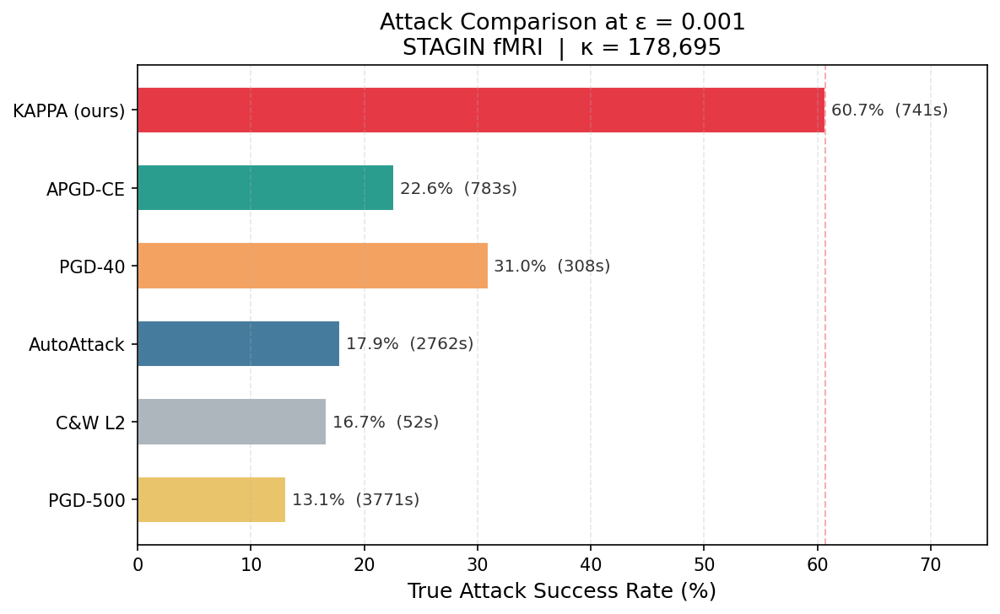
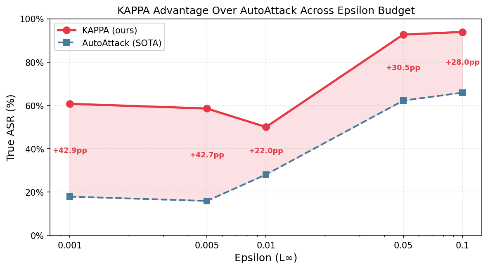
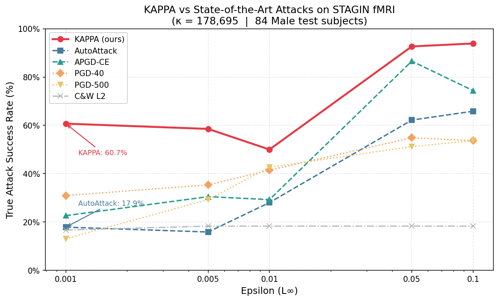

# Clinical AI proves its robustness . It Shouldn't Have.

*Nebius Serverless AI Builders Challenge – Healthcare & Life Sciences*

--- 

Clinical AI models today are frequently validated for adversarial robustness prior to deployment – and those certificates have real currency in procurement, legislation and clinical trust. Run an attack on a brain activity classifier using a gold standard robustness test and it reports 17.9% attack success — seems secure. We run KAPPA, the second-order attack proposed in this work, and the identical model exhibits **60.7% vulnerability** with a perturbation below the noise level of the MRI collection.

AutoAttack missed more than two-thirds of those cases. This is not a problem with the model. It is a structural limitation of attack that relies solely on gradient direction — including the current state of the art.

--- 

### Why It Matters for Medical AI

A robustness certificate for a clinical AI model influences real decisions, such as a hospital deciding to implement the system, a regulator deciding to authorize it, or a clinician deciding to accept its output. That certificate carries the assumption that the testing tool used to test it was adequate.

Current tools were created for a different type of AI. The standard robustness standards were developed and tested using image classifiers, the ones that recognize cats and cars. Clinical AI uses fundamentally distinct architectures: graph networks for brain connectivity, recurrent networks for cardiac data, attention models for medical imaging. These architectures have a distinct geometry and the standard tests have never been created for them.

This is not a theoretical issue. The discrepancy is observable and reproducible and substantial enough to matter in practice.

The rest of this piece describes the geometry behind it – and shows it in action on two clinical models running on a Nebius H200 GPU.

--- 

## A Common Pitfall in First-Order Attacks

The terrain of adversarial attacks covers a range of sophistication. At the conventional end, **PGD** (Madry et al., 2018) makes a sign-gradient step and projects onto the L∞ ball. The state of the art **AutoAttack** (Croce & Hein, 2020) includes four attacks: APGD-CE (adaptive step-size PGD), APGD-DLR, FAB-T (boundary minimization) and Square Attack (black-box random search). AutoAttack is specifically developed to address recognized drawbacks of vanilla PGD: sensitivity to the step size, choice of the loss function and local optima.

However, all these assaults share one essential property: **they use only first-order information**. APGD’s adaptive step scheduler makes gradient steps smarter, but it can’t repair a misleading gradient direction – and gradient directions are routinely misleading on ill-conditioned loss surfaces.

If the Hessian condition number κ is big, then some loss directions are orders of magnitude sharper than others. The gradient steps oscillate in the steep directions, and stall in flat ones. More iterations only make the problem worse, not better.

I developed **KAPPA** (κ-**A**daptive **P**roximal **P**erturbation **A**ttack) to solve this at the root. KAPPA does not follow the gradient, but instead computes the Newton direction at each outer iteration, which is a search direction that incorporates curvature, not simply slope. The Hessian is never explicitly formed, but approximated on-the-fly using Hessian-Vector Products computed using double-backward passes, which makes KAPPA scalable to big models. A proximal regularization term is introduced to obtain numerical stability in ill-conditioned regions. A comprehensive description of the method may be found in an upcoming publication . It is model agnostic: it only requires a differentiable PyTorch `forward()`.

Main hypothesis: **κ predicts the advantage of KAPPA over the state of the art.** For small κ (∼ 8,000), the Newton and gradient directions are largely the same -- KAPPA adds overhead with no proportional advantage. In the case of high κ (∼ 180,000), the Newton direction reaches adversarial cases unreachable by any first-order approach.

--- 

## Two Clinical Models for Testing the Hypothesis

To test the κ hypothesis I needed two architectures with condition numbers that were significantly different.

**ECG Rhythm Classifier — PhysioNet/CinC 2017 Challenge**
A 13-block dilated 1D CNN (Han et al. architecture) for 4-class rhythm classification. There is a Batch Normalization after each convolutional block. BN normalizes gradient magnitudes layer by layer, which greatly relieves ill-conditioning . Measured κ ≈ 8,000. Test accuracy: 87.5%

** STAGIN on HCP - fMRI Sex Classifier**
A Spatio-Temporal Attention Graph Isomorphism Network (Kim & Ye) trained on 1,080 resting-state fMRI scans (756 train / 108 val / 216 test) from the Human Connectome Project. Preprocessing pipeline: CIFTI files → 333 ROIs (Gordon atlas) → 50-TR sliding-window functional connectivity matrices (51 windows per 1,200-TR acquisition). Model is a combination of 4 GIN layers, self attention with single head and GRU over time. While the GIN and SERO modules rely on BatchNorm1d and the Transformer LayerNorm the measured Hessian spectrum reveals that the unnormalized GRU temporal path is a highly ill-conditioned environment anyway. Training was performed with onecycleLR scheduling, orthogonality regularization (lambda=1e-5) and early stopping with patience=30. Measured condition number: κ = **178,695**. BACC Test: 77.2%

> *Figure 1 — For ε = 0.001, KAPPA achieves 60.7% ASR while AutoAttack (SOTA) achieves just 17.9% — a 3.4× disparity. Bar widths incorporate wall-clock time to indicate efficiency advantage not only accuracy.*

 

The prediction is simple: KAPPA should perform poorly against first-order attacks on the ECG model (κ = 8,000), and greatly exceed them on STAGIN (κ ≈ 180,000).

---

## The System Architecture

The full pipeline runs across three components:

```
Local Machine                      Nebius Cloud
─────────────────                  ──────────────────────────────────
nebius-fmri-adversarial/           H200 SXM (141 GB HBM3e)
  hessian.py  ──┐                  ┌── test_fmri_model.py
  STAGIN.py   ──┤                  │     └─ KAPPA × 6 attacks × 5 ε
  configs/    ──┤                  │     └─ partial save after each ε
                │   Nebius AI Job  │
                ├─── deploy ──────►│
                │                  └── results → S3
                │
                │   S3 precision-med-hcp/ (~1.8 GB, shared read-only)
                │     roi_timeseries.npy  ← 1,080 subjects pre-processed
                │     best_model_fmri.pth ← STAGIN checkpoint
                ├─── upload-data ──► your-bucket/
                └─── download ◄──── output/attack_results.json
```

The entire workflow is three Makefile targets:

```makefile
make upload-data       # sync roi_timeseries.npy + saved_model/ to your bucket (once)
make deploy-attack     # launch H200 job, write results directly to S3
make download-results  # pull attack_results.json when job completes
# Resume a failed job from the last completed epsilon:
make deploy-attack RESUME_RUN_ID=20260628_035830
```

Results write directly to the S3-mounted filesystem after each epsilon completes. A job crash loses at most one epsilon's work — the resume mechanism reloads the partial JSON and skips already-completed runs.

---

## Why the H200 Was Not Optional

Computing Hessian-Vector Products requires retaining the full computational graph through two backward passes. On STAGIN with batch=32:

```
Resource                     Value
─────────────────────────────────────────────────────────────
Input per subject            [51×333×333] adjacency + [1200×333] timeseries
Peak VRAM (KAPPA backward)   86,876 MB
A100 SXM capacity            80,000 MB
H200 SXM capacity            141,000 MB
Headroom on H200             ~54 GB
```

You can't do this experiment on an A100. The H200 SXM on Nebius Serverless AI, it wasn’t a choice, it was the least powerful GPU that could do the job.

Deployment was a single CLI call:

```bash
nebius ai job create \
  --parent-id $PARENT_ID \
  --name fmri-adversarial-attack \
  --image pytorch/pytorch:2.2.2-cuda12.1-cudnn8-runtime \
  --platform gpu-h200-sxm \
  --preset 1gpu-16vcpu-200gb \
  --disk-size 200Gi \
  --shm-size 32Gi \
  --volume $BUCKET_ID:/workspace/data \
  --container-command bash \
  --args '-c "apt-get update -qq && apt-get install -y git -q && cd /workspace/data && pip install --no-cache-dir -r requirements.txt && python test_fmri_model.py --config configs/config.yaml --output-dir /workspace/data/output"'
```

No cluster setup, no persistent VM billing, no storage provisioning beyond the S3 bucket. Total job runtime: ~10 hours. Total cost: < $100.

---

## The Honest Part: Three Bugs That Cost a Full H200 Job

To get six attack libraries to work together on a GRU-based GNN was more iterative than anticipated. Each of those three failures was silent, no crash, no error, just inaccurate results, which made them expensive to detect on a 6 hour H200 work.

**1. Sub-batch size mismatch (discovered after 6 hours)**

The first full job completed cleanly, then I checked the output and found that AutoAttack had reported 0% ASR across all epsilons. No exception was raised. Digging into AutoAttack's internals revealed that it internally splits batches into sub-batches and calls `forward(v_sub)` with fewer samples than the original batch B. STAGIN's GRU produces hidden states fixed at size B; `torch.cat([v, time_encoding], dim=3)` silently skipped the incompatible tensors.

The fix: a `ForwardWrapper` that adds the padding back to B with zeros and returns only the required logits:

```python
class ForwardWrapper(torch.nn.Module):
    def forward(self, v):
        n, B = v.shape[0], self._B
        if n < B:
            pad = torch.zeros((B - n,) + v.shape[1:], device=v.device, dtype=v.dtype)
            v_run = torch.cat([v, pad], dim=0)
        else:
            v_run = v
        self.model.train()
        logits, _, _, _ = self.model(v_run, self._a, self._t, self.endpoints)
        return logits[:n]
```

**2. cuDNN RNN backward requires training mode (discovered mid-sweep)**

C&W L2 completed but 0% ASR on all batches. Underlying problem: cuDNN backend of PyTorch requires `model.train()` when RNN backward passes. The original code calls `model.eval()` inside `forward()`, a normal inference pattern, which restores eval mode before backward runs, silently zeroing gradients. Fix: retain `train()` for the whole attack sweep, never restoring `eval()`.

**3. Binary AutoAttack (warning buried in 10,000 lines of output)**

AutoAttack's standard configuration includes DLR loss and FAB-T, which require ≥3 classes. On a binary classifier these components issue a one-line warning — easily missed — and produce undefined results. Fix:

```python
adversary = AutoAttack(wrapper, norm="Linf", eps=epsilon,
                       version="custom",
                       attacks_to_run=["apgd-ce", "square"],
                       verbose=False)
```

After fixing all three, I also added a partial save after each epsilon and a `RESUME_RUN_ID` flag so future failures could pick up from the last completed checkpoint rather than restarting from zero.

---

## Results

Six attacks evaluated: KAPPA, AutoAttack (APGD-CE + Square — current state of the art), APGD-CE, PGD-40, PGD-500 (budget-matched to KAPPA), and C&W L2. Metric: **True ASR** — fraction of Male subjects (n=82–84, varies by ε due to dropout active in train() mode) whose prediction flips to Female. This targeted metric avoids inflating rates with trivially adversarial examples.

### ECG CNN (κ ≈ 8,000) — Baseline Validation

```
Method    ε     True ASR
─────────────────────────
PGD       10    86.5%
KAPPA     10    72.9%
PGD        2    24.0%
KAPPA      2    21.9%
```

On the BN-normalized ECG model, **PGD outperforms KAPPA**. At ε=2, both are equivalent; at ε=10, KAPPA is 13.6 pp worse. This is exactly what the κ ≈ 8,000 prediction requires: BN reduces ill-conditioning significantly, the Newton direction adds little over gradient, and CG overhead makes KAPPA strictly less efficient. The baseline holds — KAPPA does not claim universal superiority.

> *Figure 2 — KAPPA advantage over AutoAttack across all five epsilon values. The shaded area shows percentage points gained by using KAPPA. The gap is largest at tight budgets (ε=0.001–0.005), where imperceptible perturbations matter most clinically.*



### STAGIN fMRI (κ = 178,695) — Main Result

```
Attack        ε=0.001  ε=0.005  ε=0.01  ε=0.05   ε=0.1
──────────────────────────────────────────────────────────
KAPPA *        60.7%    58.5%   50.0%   92.7%    93.9%
APGD-CE        22.6%    30.5%   29.3%   86.6%    74.4%
PGD-40         31.0%    35.4%   41.5%   54.9%    53.7%
AutoAttack     17.9%    15.9%   28.1%   62.2%    65.9%
C&W L2         16.7%    18.3%   18.3%   18.3%    18.3%
PGD-500        13.1%    29.3%   42.7%   51.2%    53.7%

* KAPPA leads across all epsilon values
```

> *Figure 3 — True ASR vs epsilon for all six attacks on STAGIN. KAPPA (red solid) consistently leads the first-order family. Note that PGD-500 (yellow dotted) is worse than PGD-40 at ε=0.001 — a direct signature of gradient oscillation in an ill-conditioned landscape.*



At ε=0.001 — a perturbation imperceptible to preprocessing pipelines:

```
Comparison                  KAPPA    Competitor          Gap
──────────────────────────────────────────────────────────────
vs AutoAttack (SOTA)        60.7%    17.9%               3.4×
vs APGD-CE (SOTA component) 60.7%    22.6%               2.7×
vs PGD-500 (budget-matched) 60.7%    13.1%               4.6×
Wall-clock time             741s     3,771s (PGD-500)    5× faster
```

**PGD-500 is worse than PGD-40** (13.1% vs 31.0%) at this epsilon. With κ=178,695, more gradient iterations amplify oscillation; the model appears robust under any first-order evaluation simply because the attacks cannot navigate its loss surface.

Three patterns across the sweep:
1. **Tight budgets (ε≤0.005):** KAPPA leads AutoAttack by 2.7–3.7×. This is the clinically relevant regime: perturbations small enough to evade human inspection.
2. **Mid-range (ε=0.01):** First-order methods partially recover. APGD-CE reaches 29.3% vs KAPPA's 50% — a 1.7× gap — as the larger epsilon ball gives gradient methods more room.
3. **Large epsilon (ε=0.05–0.1):** KAPPA saturates at 93%+. First-order attacks plateau near 53–66%, unable to reach the adversarial region even with an unconstrained budget.

C&W L2 flatlines at ~18% across all epsilons — STAGIN's vulnerability is structurally aligned with L∞ directions, not L2.

---

## Conclusion

AutoAttack reports 17.9% ASR. KAPPA reports 60.7%. **A model that passes the current gold-standard robustness evaluation has 3.4× greater true vulnerability** — not because AutoAttack is flawed, but because the assumption it was built on (well-conditioned loss surfaces) does not hold for GNNs, RNNs, and un-normalized architectures common in medical AI. The κ estimate — computed cheaply before running any attack — tells you which evaluation regime you are in. If κ ≫ 1, PGD-family attacks are navigating with a broken compass.

The clinical implication is direct. A brain connectivity model, a physiological time series classifier, or an EHR prediction system can pass every standard robustness benchmark and still be systematically exploitable — not because the model is poorly trained, but because the evaluation method was never designed for its geometry. A certificate that says "this model is robust" may be answering the wrong question with the wrong tool. For systems that inform diagnosis, triage, or treatment decisions, that gap is not academic.

---

## Code and Reproducibility

KAPPA is implemented in `hessian.py`, model-agnostic and requiring only a differentiable PyTorch `forward()`. The full evaluation pipeline — model checkpoints, configs, Nebius job scripts, partial-save/resume logic, and `attack_results.json` — is open-source:

**[github.com/diegom4riano/nebius-fmri-adversarial](https://github.com/diegom4riano/nebius-fmri-adversarial)**

---

*#NebiusServerlessChallenge — Healthcare & Life Sciences*
